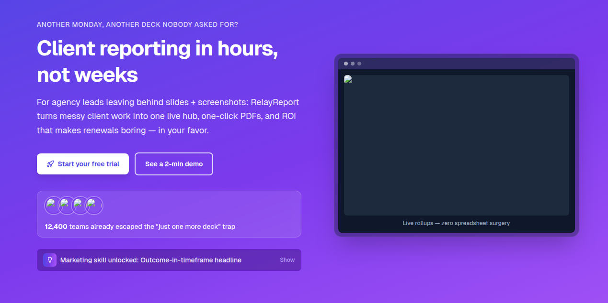

<div align="center">



**[🌐 Live site — relay-report-vjeb.vercel.app](https://relay-report-vjeb.vercel.app/)**

</div>

# 🚀 RelayReport

**RelayReport** is the marketing site and landing experience for an agency-focused client-reporting product: one live hub for metrics, polished PDF exports, and renewals backed by real numbers instead of slide decks and screenshots.

## ✨ What this repo is

- **⚡ Next.js 15** + **⚛️ React 19** + **🎨 Tailwind CSS** — fast, modern stack for the public site at **[relay-report-vjeb.vercel.app](https://relay-report-vjeb.vercel.app/)**
- **📣 Story-first landing page**: hero, problem/solution, feature “superpowers,” social proof, pricing, FAQ, and footer — tuned for agency leads who want reporting without the weekend deck grind
- **☁️ Deploy-ready** on Vercel (same lineage as the live demo above)

> **🖼️ Banner image:** add `relay.png` in the **repo root** (same folder as this README). GitHub will show it at the top automatically after you commit.  
> *(If you named it `relay.pnd`, rename it to `relay.png` so the markdown image works.)*

## 🏃 Getting started

```bash
npm install
npm run dev
```

Open **[http://localhost:3000](http://localhost:3000)** to hack on the app. Edit `app/page.tsx` (and related components under `app/`) — the dev server hot-reloads.

### 🧰 Other scripts

| Command           | What it does           |
| ----------------- | ---------------------- |
| `npm run build`   | Production build       |
| `npm run start`   | Run production server  |
| `npm run lint`    | ESLint                 |

## 🧩 Stack highlights

- **UI**: Radix Accordion, Lucide icons, `class-variance-authority` / `clsx` / `tailwind-merge` for tidy styling

## 🚢 Deploy

This project is built for **[Vercel](https://vercel.com)** — connect the repo or push to your linked project for previews and production.

## 📜 License

This project is released under the **[MIT License](LICENSE)** — copyright **raimonvibe** (2026).

---

Made with agency sanity in mind. **Ship the live room, not another Friday deck.** ✨
